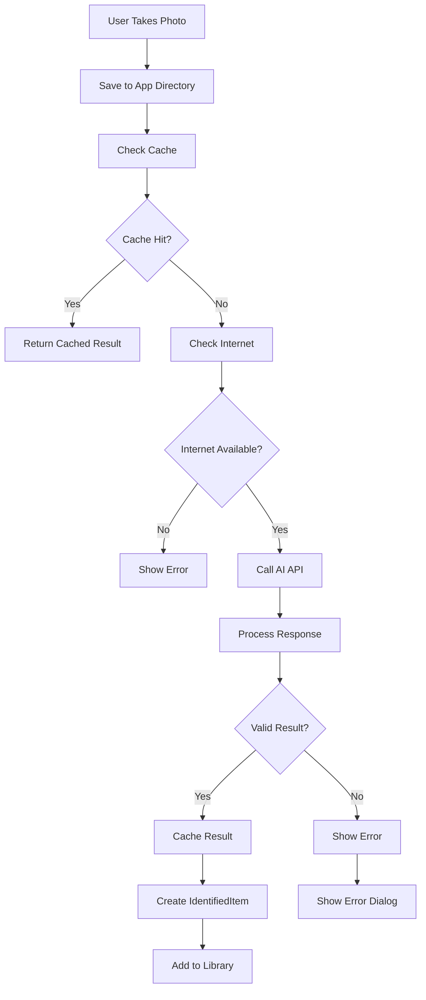

# Snake Identifier App - Technical Documentation

## 🐍 Overview

Snake Identifier is a Flutter application that uses AI to identify snakes from photos. The app provides detailed information about identified snakes, including species, behavior, habitat, safety information, and conservation status.

## 🏗️ Architecture

### Project Structure

```
lib/
├── core/                    # Core app functionality
│   ├── constants/          # App constants
│   ├── navigation/         # Routing and navigation
│   ├── theme/             # App theming
│   └── widgets/           # Reusable UI components
├── data/                   # Data layer
│   └── models/            # Data models
├── features/               # Feature-based modules
│   ├── about/             # About screen
│   ├── app_shell/         # Main app shell
│   ├── chat/              # AI chat functionality
│   ├── home/              # Home screen
│   ├── library/           # Library feature (main)
│   ├── onboarding/        # Onboarding flow
│   ├── paywall/           # Subscription paywall
│   └── settings/          # Settings screen
├── services/               # Business logic services
│   ├── cache_service.dart
│   ├── chat_service.dart
│   ├── connectivity_service.dart
│   ├── image_processing_service.dart
│   ├── logging_service.dart
│   └── theme_service.dart
└── main.dart              # App entry point
```

### Design Patterns

- **MVVM (Model-View-ViewModel)**: Used for state management
- **Dependency Injection**: Using GetIt for service locator pattern
- **Provider**: For reactive state management
- **Repository Pattern**: For data access abstraction

## 📱 Key Features

### 1. Snake Identification

- **Camera Integration**: Take photos of snakes directly in the app
- **Gallery Selection**: Choose existing snake photos
- **AI Processing**: Uses custom AI backend for identification
- **Caching**: Results are cached for offline access

### 2. Library Management

- **Grid View**: Displays identified items in a responsive grid
- **Detail View**: Comprehensive information about each Snake
- **Search & Filter**: Find specific items quickly
- **Delete Functionality**: Remove items from library

### 3. AI Chat

- **Contextual Conversations**: Chat about specific identified items
- **Expert Knowledge**: Get detailed answers about snakes
- **History**: Maintain conversation context

### 4. Subscription System

- **Freemium Model**: Limited free usage, unlimited with subscription
- **RevenueCat Integration**: Handles subscription management
- **Paywall**: Beautiful subscription interface

## 🔧 Technical Implementation

### Image Processing Workflow



### Services Architecture

#### ImageProcessingService

```dart
class ImageProcessingService {
  // Handles all AI identification logic
  Future<IdentifiedItem?> processImage(String imagePath)

  // Saves images with unique filenames
  Future<String> saveImageToAppDir(String imagePath)

  // Calls AI backend for identification
  Future<Map<String, dynamic>?> _identifySnakeWithAI(File imageFile)
}
```

#### CacheService

```dart
class CacheService {
  // Cache AI results for offline access
  Future<void> cacheAnalysisResult(String imagePath, Map<String, dynamic> result)

  // Retrieve cached results
  Future<Map<String, dynamic>?> getCachedAnalysisResult(String imagePath)

  // Manage cache size and cleanup
  Future<void> clearCache()
}
```

#### LoggingService

```dart
class LoggingService {
  // Centralized logging using Fimber
  static void debug(String message, {String? tag})
  static void error(String message, {Object? error, StackTrace? stackTrace})
  static void userAction(String action, {String? details})
  static void apiOperation(String operation, {String? details})
}
```

### Data Models

#### IdentifiedItem

```dart
class IdentifiedItem {
  final String id;
  final String imagePath;
  final String result;        // Common name
  final String subtitle;      // Period/era
  final double confidence;    // AI confidence score
  final Map<String, dynamic> details;  // Detailed information
  final DateTime dateTime;    // When identified
}
```

## 🎨 UI/UX Design

### Design System

- **Material Design 3**: Modern, accessible design
- **Dark/Light Theme**: Automatic theme switching
- **Responsive Layout**: Works on all screen sizes
- **Smooth Animations**: Polished user experience

### Key UI Components

#### Library Grid

- **2-column grid** on mobile devices
- **Hero animations** for smooth transitions
- **Safety badges** for venomous snakes
- **Confidence indicators** for AI accuracy

#### FAB Menu

- **Animated expansion** with backdrop blur
- **Camera and gallery** options
- **Processing states** with loading indicators

#### Detail Screen

- **Hero image** with parallax effect
- **Condition status** prominently displayed
- **Historical information** in organized sections
- **Chat integration** for questions

## 🔐 Security & Privacy

### Permissions

- **Camera**: For taking photos
- **Photo Library**: For selecting existing images
- **Internet**: For AI processing and chat

### Data Handling

- **Local Storage**: Images and results stored locally
- **No Personal Data**: No user accounts or personal information collected
- **Secure API**: HTTPS communication with backend

## 🚀 Performance Optimizations

### Image Processing

- **Compression**: Images compressed before upload
- **Caching**: Results cached to avoid duplicate API calls
- **Background Processing**: Non-blocking UI during processing

### Memory Management

- **Image Disposal**: Proper cleanup of image resources
- **Lazy Loading**: Images loaded only when needed
- **Cache Limits**: Automatic cache size management

## 📊 Analytics & Monitoring

### Logging Strategy

- **Structured Logging**: Using Fimber for consistent logging
- **Error Tracking**: Comprehensive error logging
- **User Actions**: Track user interactions for insights
- **Performance Metrics**: Monitor app performance

### Key Metrics

- **Identification Success Rate**: Track AI accuracy
- **User Engagement**: Library usage and feature adoption
- **Error Rates**: Monitor and fix issues quickly
- **Performance**: App responsiveness and load times

## 🔄 State Management

### Provider Pattern

```dart
// Library ViewModel
class LibraryViewModel extends ChangeNotifier {
  List<IdentifiedItem> _items = [];

  void addItem(IdentifiedItem item) {
    _items.add(item);
    notifyListeners();
  }

  void deleteItem(String id) {
    _items.removeWhere((item) => item.id == id);
    notifyListeners();
  }
}
```

### Service Locator

```dart
// Dependency injection with GetIt
final locator = GetIt.instance;

// Register services
locator.registerSingleton<ImageProcessingService>(ImageProcessingService());
locator.registerSingleton<CacheService>(CacheService());
```

## 🧪 Testing Strategy

### Unit Tests

- **Service Tests**: Test business logic in isolation
- **Model Tests**: Validate data models
- **Utility Tests**: Test helper functions

### Widget Tests

- **Component Tests**: Test individual widgets
- **Integration Tests**: Test user workflows
- **Golden Tests**: Visual regression testing

## 📦 Dependencies

### Core Dependencies

- **Flutter**: UI framework
- **Provider**: State management
- **GetIt**: Dependency injection
- **Fimber**: Logging
- **Image Picker**: Camera/gallery access

### AI & Backend

- **HTTP**: API communication
- **RevenueCat**: Subscription management
- **Connectivity Plus**: Network status

### UI & UX

- **HugeIcons**: Icon library
- **Path Provider**: File system access
- **Shared Preferences**: Local storage

## 🚀 Deployment

### Build Configuration

- **iOS**: Configured for App Store deployment
- **Android**: Ready for Google Play Store
- **Web**: Progressive Web App support

### Release Process

1. **Version Management**: Semantic versioning
2. **Code Signing**: Proper certificates and provisioning
3. **App Store Optimization**: Metadata and screenshots
4. **Beta Testing**: TestFlight and internal testing

## 🔮 Future Enhancements

### Planned Features

- **Offline Mode**: Full offline functionality
- **Social Features**: Share discoveries
- **Advanced Filtering**: Search by characteristics
- **Educational Content**: Learning modules
- **AR Integration**: Augmented reality features

### Technical Improvements

- **Performance**: Further optimization
- **Accessibility**: Enhanced accessibility features
- **Internationalization**: Multi-language support
- **Analytics**: Enhanced user insights

## 🤝 Contributing

### Development Setup

1. **Clone Repository**: `git clone [repository-url]`
2. **Install Dependencies**: `flutter pub get`
3. **Run App**: `flutter run`
4. **Run Tests**: `flutter test`

### Code Standards

- **Dart Analysis**: Follow Dart style guide
- **Documentation**: Comprehensive code comments
- **Testing**: Maintain high test coverage
- **Logging**: Use structured logging throughout

## 📞 Support

### Documentation

- **API Documentation**: Backend API specifications
- **User Guide**: End-user documentation
- **Developer Guide**: Technical implementation details

### Contact

- **Issues**: GitHub issue tracker
- **Email**: hello.ivantrj@gmail.com
- **Documentation**: In-app help and tutorials

---

_This documentation is maintained as part of the Snake Identifier app development process. For the latest updates, refer to the source code and commit history._
